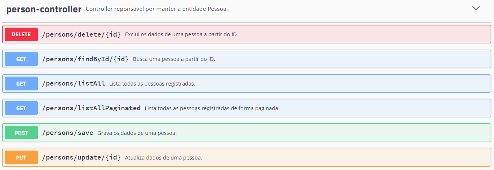

# Pessoas API REST
Esse projeto é um CRUD referente a entidade pessoa que possui os seguintes campos <b>[id, nome, cpf e data_nascimento]</b>.

### Pré-requisitos
Você precisará de uma IDE (<b>Eclipse, intellij entre outras IDE's</b>) para a execução do projeto ou será necessário compila-lo para executar com (java -jar).
### Instalação
Para limpar e instalar o projeto será necessário executar o comando:
> mvn clean install

Para executar o projeto será necessário executar o comando:
> mvn spring-boot:run

Após a execução do comando, será necessário aguardar o aplicação inicializar e poderá acessar pelo link:
> http://localhost:8080